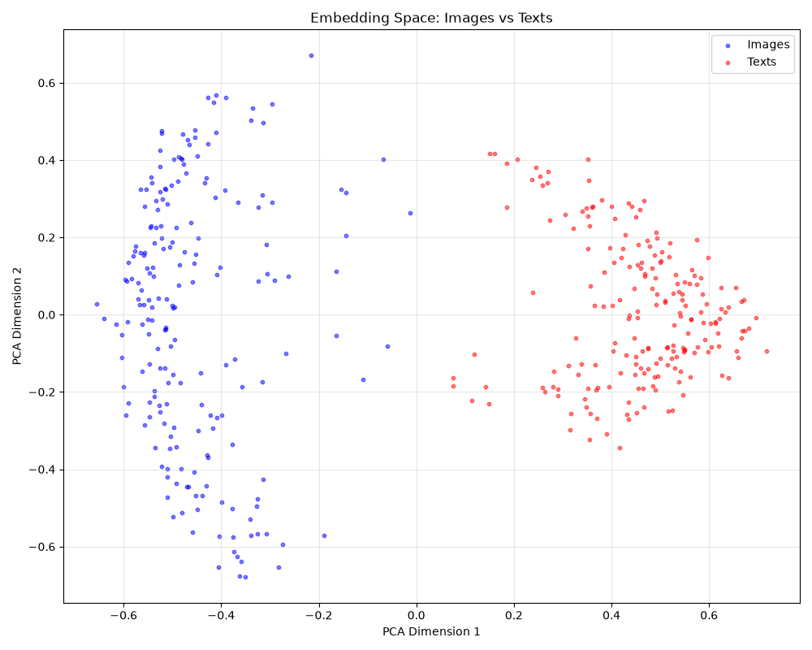
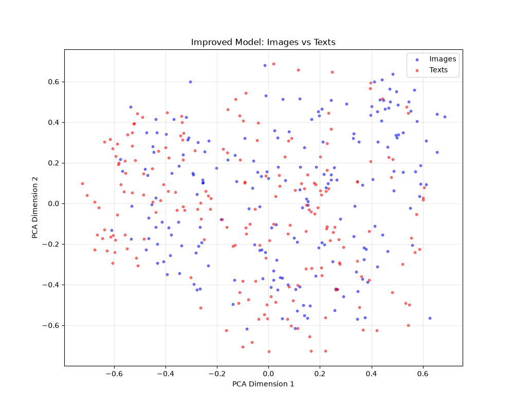

# TinyCLIP - Multimodal AI Model from Scratch

A CLIP-style model that learns to match images to text using
contrastive learning. The model is trained on 5,000 image-caption
pairs from the COCO dataset.

---

## What I Built

- **Custom model** - CNN (image encoder) + Transformer
  (text encoder) made and trained from scratch
- **Improved (pre-trained encoders) model** - ResNet + DistilBERT
  with pre-trained weights (pre-trained image and text encoders)
- **Model Evaluation** - Recall@K, MRR, and zero-shot
  classification of images
- **Model Visualization** - PCA embedding plots (shows text and
  image encodings in shared vector space, portraying encoding
  similarity)

**Both models are trained and evaluated under identical**
**conditions to isolate the impact of pre-trained encoders**
**on cross-modal alignment.**

---

## How It Works

1. **Image Encoder**: ResNet18 → 128-dim embedding
2. **Text Encoder**: DistilBERT → 128-dim embedding
3. **Contrastive Loss**: Pulls embeddings of matching text/image
   pairs together, pushes non-matching apart
4. **Temperature Scaling**: Controls confidence of matches (balances
   creativity and accuracy to produce natural-looking outputs)

---

## What I Learned

Multimodal models like CLIP are the backbone of modern AI,
especially as industry applications of AI increasingly require
the use of a variety of modalities. Building a multimodal
model from scratch taught me:
- How contrastive learning aligns different modalities 
  (my TinyCLIP model works to align texts and images in a
  128-dim vector space)
- How pre-trained encoders accelerate learning (the improved
  model led to a vastly better alignment of the text and image
  encoders outputs after the contrastive learning process)
- The importance of scale (data + training cycles)

---

# Results

## Retrieval Performance (Evaluated on 500 Images)

| Model | Recall@1 | Recall@5 | Recall@10 | MRR |
|-------|----------|----------|-----------|-----|
| Random Baseline | 0.0020 | 0.0100 | 0.0200 | 0.0040 |
| Custom | 0.0000 | 0.0100 | 0.0140 | 0.0116 |
| Improved | 0.2320 | 0.5960 | 0.7680 | 0.3959 |

**Interpretation:**
- While the custom model's top 10 outputs captured the correct
  match less often than the mean of 10 random outputs (1.4% vs 2%),
  the custom model's average placement of the correct match in the
  outputs (rank ~86) is much closer to the top than the correct
  match's average placement in random trials (rank 250).
- The improved model captured the correct match with its first
  output 23.2% of the time, within its top 5 outputs 59.6% of the
  time, and within its top 10 outputs 76.8% of the time, showing
  significant improvement over the random baseline and custom
  model. Additionally, the model's average rank of the correct
  match improved to around 2-3, showing a dramatic improvement over
  the custom model.
- The improved model's vast outperformance of the custom model
  shows that pre-trained encoders better contrastive learning
  results even with limited data.

## Zero-Shot Classification (Images Randomly Selected Every Time)

**Custom model top predictions (with confidence):**
Image 1:
  1. tennis racket (1.3%)
  2. spoon (1.3%)
  3. bottle (1.3%)

Image 2:
  1. spoon (1.4%)
  2. fire hydrant (1.3%)
  3. bicycle (1.3%)

Image 3:
  1. traffic light (1.3%)
  2. skateboard (1.3%)
  3. bench (1.3%)

Image 4:
  1. spoon (1.3%)
  2. fire hydrant (1.3%)
  3. dining table (1.3%)

Image 5:
  1. traffic light (1.3%)
  2. skateboard (1.3%)
  3. bottle (1.3%)

**Improved model top predictions (with confidence):**
Image 1:
  1. bicycle (2.1%)
  2. clock (1.8%)
  3. motorcycle (1.8%)

Image 2:
  1. motorcycle (2.0%)
  2. car (1.9%)
  3. bed (1.5%)

Image 3:
  1. hair drier (2.0%)
  2. toothbrush (1.9%)
  3. scissors (1.8%)

Image 4:
  1. car (2.4%)
  2. truck (1.9%)
  3. parking meter (1.8%)

Image 5:
  1. airplane (2.0%)
  2. kite (1.7%)
  3. traffic light (1.6%)

## Embedding Space

**Custom Model (From Scratch)**


The custom model shows limited alignment between images and texts;
there is largely separation between textembeddings and image
embeddings. The low overlap suggests poor contrastive learning
between the two encoders.

**Improved Model (Pre-trained Encoders)**


The improved model shows better alignment between the two
modalities. There is significant overlap between text and image
embeddings, suggesting improved contrastive learning between the
encoders.

The embedding spaces of the custom and improved models provide
further evidence that contrastive learning better aligns
encoders with more extensive training, even on a dataset of only
5,000 image-caption pairs.

---

# Limitations

- Small model (128-dim embeddings) due to CPU training
- Limited data (5,000 images)
- Low zero-shot confidence (2-3%) due to scale

---

# Future Steps

- Scale to 20,000+ images on GPU
- Increase embedding dimension to 256+
- Use CLIP's text encoder instead of DistilBERT
- Deploy as a Gradio demo

---

# Tech Stack

- PyTorch, torchvision
- HuggingFace Transformers
- scikit-learn, matplotlib
- COCO dataset

---

# How to Run the Improved Model

```bash
pip install -r requirements.txt
python train_improved_model16.py
python evaluate_improved17.py
python visualize_improved_embeddings.py
python zero_shot_eval_improved.py